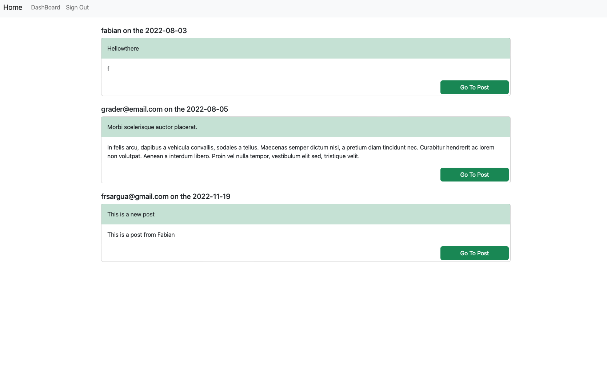

# Tech-Blogwebsite

# Links

[Heroku deployed app 💾](https://immense-basin-10320.herokuapp.com)

# Table of Contents

- [Description](#description)
- [Installation](#Installation)
- [Usage](#Usage)
- [License](#License)
- [Contributing](#Contributing)
- [Tests](#Tests)
- [Questions](#Questions)

## Description

A full-stack blog website that allows the user to create and delete posts, and add comments.

## Installation

To run the app in the local server, clone the repository to your local memory follow the instructions below:

```
cd Tech-Blogwebsite
npm install
npm start       <--- To run the app in a localhost
```

## Usage

```
Technologies used:
JavaScript - Handlebars - CSS- HTML - Cookies - JSON - Github Pages - Bootstrap - MySQL - Express.js

```

- Below are screenshots of the deployed app in Heroku:
  
  
  
  
  
  
  
  
  

Functionality: - Allows user to:

- SignIn
- SignUp
- Create post
- Modify/delete post
- Leave comment
- Modify/delete comment

# License

This project is not covered by a license.

## Contributing

No contribution

## Tests

No tests available for this task.

## Questions:

GitHub: https://github.com/frsargua

email: frsargua@gmail.com
